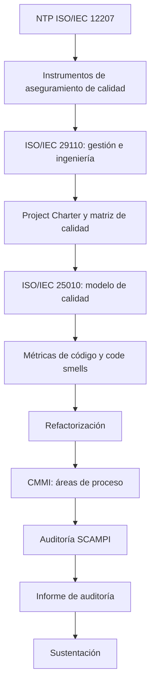

# Guía del Proyecto Sello de Ingeniería de Software II

## 1. Propósito

El Proyecto Sello integra las sesiones de **Ingeniería de Software II** alrededor de un mismo proyecto integrador que se audita (o se desarrolla, según la ruta elegida por el equipo) de manera progresiva. Cada sesión agrega una capacidad real de evaluación de calidad de procesos y de producto hasta llegar a un informe de auditoría fundamentado en estándares internacionales, con hallazgos verificables y sustentado integralmente.

### Competencia o capacidad del proyecto

Al finalizar el Proyecto Sello, el estudiante demuestra que puede evaluar la calidad de los procesos y del producto de un proyecto de software aplicando la NTP ISO/IEC 12207, la ISO/IEC 29110, la ISO/IEC 25010 y el modelo de madurez CMMI, auditar su ciclo de vida mediante el método SCAMPI, y sustentar el informe de auditoría (o de desarrollo de software) resultante.

### Competencias relacionadas

| Código | Competencia | Relación con el proyecto |
|---|---|---|
| CE024 | Calidad de Software | Evidencia la gestión técnica y aseguramiento de calidad del proceso (CE0243) y la auditoría técnica y evolución del sistema (CE0244) mediante NTP ISO/IEC 12207, ISO/IEC 29110, ISO/IEC 25010, CMMI y SCAMPI. |
| CE021 | Ingeniería de Requerimientos | Evidencia la formulación del Project Charter y la delimitación del alcance del proyecto auditado o desarrollado. |
| CE023 | Programación | Evidencia el software auditado o, si el equipo elige la ruta de desarrollo, el sistema construido y evaluado según la ISO/IEC 25010. |

Fuente oficial de los códigos: [Transcripción de evidencias por competencia — Ingeniería de Software](https://upeuoficial.github.io/planb/transcripcion/#c-area-de-ingenieria-de-software).

```text
NTP ISO/IEC 12207 -> ISO/IEC 29110 -> Project Charter y matriz de calidad -> ISO/IEC 25010 -> Code smells y refactorización -> CMMI -> Auditoría SCAMPI -> Informe -> Sustentación
```

## 2. El Proyecto

Durante el semestre auditarás (o desarrollarás, según la ruta elegida por el equipo) un **proyecto de software**, aplicando el modelamiento de procesos de la NTP ISO/IEC 12207, los procesos de gestión e ingeniería de la ISO/IEC 29110, el modelo de calidad de producto de la ISO/IEC 25010, y los niveles de madurez del modelo CMMI evaluados mediante el método SCAMPI.

El proyecto debe partir de un sistema o proyecto de software real (propio, de un tercero o simulado) y avanzar mediante entregables acumulativos: Project Charter con matriz de calidad, evaluación de calidad de software con identificación y refactorización de code smells, y checklists de auditoría SCAMPI que culminan en un informe final.

El proyecto debe cumplir estas condiciones:

- Partir de un sistema o proyecto de software real, claramente delimitado.
- Formular un Project Charter fundamentado en la NTP ISO/IEC 12207 y la ISO/IEC 29110, con una matriz de calidad (atributos, métricas y riesgos).
- Evaluar la calidad interna y externa del software con el modelo de la ISO/IEC 25010, identificando y priorizando code smells como deuda técnica.
- Aplicar refactorización sobre el código fuente evaluado para mejorar su mantenibilidad.
- Auditar el ciclo de vida de gestión de proyecto, ingeniería y software mediante checklists SCAMPI, referenciando los niveles de madurez CMMI aplicables.
- Ser sustentado técnicamente por todos los integrantes del equipo.

No se considera Proyecto Sello:

- Una auditoría sin proyecto de software real detrás (ni propio ni de terceros).
- Checklists de auditoría llenados sin evidencia verificable del proceso o producto auditado.
- Una evaluación ISO/IEC 25010 sin métricas ni código fuente real analizado.
- Code smells identificados sin priorización ni intento de refactorización.
- Un nivel de madurez CMMI asignado sin evidencia de las áreas de proceso evaluadas.
- Un informe de auditoría que el equipo no pueda sustentar con evidencias técnicas.

## 3. Evolución del Proyecto

| Unidad | Temas principales | Evolución del proyecto |
|---|---|---|
| Unidad 1: Calidad en los Procesos de Desarrollo de Software con NTP ISO/IEC 12207 e ISO/IEC 29110 | Modelamiento de procesos y métricas de la NTP ISO/IEC 12207, instrumentos de aseguramiento de calidad, gestión e ingeniería de la ISO/IEC 29110. | Project Charter fundamentado en NTP ISO/IEC 12207 e ISO/IEC 29110, con matriz de calidad. |
| Unidad 2: Calidad del Software con ISO/IEC 25010 | Modelo de calidad interna y externa, métricas de código fuente, code smells, refactorización y criterios de valoración. | Avance del proyecto con evaluación de calidad de software según la ISO/IEC 25010 y deuda técnica gestionada. |
| Unidad 3: Modelo de Madurez y Desarrollo de la Auditoría | CMMI, áreas de proceso de ingeniería, método SCAMPI aplicado a gestión, ingeniería y software. | Informe final de auditoría (o de desarrollo) que consolida el Project Charter y la evaluación de calidad, sustentado. |



### Alineamiento por sesiones

Este alineamiento muestra cómo el proyecto avanza desde el modelamiento de procesos hasta la evaluación de calidad de producto y la auditoría de madurez, consolidando un informe final.

| Sesiones | Contenido central | Avance del proyecto |
|---|---|---|
| S1 | NTP ISO/IEC 12207: modelamiento de procesos de ingeniería del ciclo de vida del software. | Lectura del estándar y organización del equipo de trabajo. |
| S2 | NTP ISO/IEC 12207: métricas de proceso e instrumentos de aseguramiento de la calidad. | Métricas de proceso (defectos, lead time, cycle time) e instrumentos de aseguramiento (revisiones, inspecciones, checklist). |
| S3 | ISO/IEC 29110: Gestión del proyecto. | Formulación inicial del Project Charter. |
| S4 | ISO/IEC 29110: Ingeniería en el desarrollo del software. | Diseño del proceso de desarrollo del software según la ISO/IEC 29110. |
| S5 | Evaluación U1: examen teórico y exposición del Project Charter. | Producto U1 sustentado: Project Charter con matriz de calidad. |
| S6 | ISO/IEC 25010: modelo de calidad del software, características internas y externas. | Priorización de atributos de calidad del sistema elegido. |
| S7 | ISO/IEC 25010: métricas de calidad de código fuente y su relación con code smells. | Identificación de code smells (duplicación, alta complejidad, bajo acoplamiento y cohesión) asociados a mantenibilidad. |
| S8 | ISO/IEC 25010: criterios de valoración del software y refactorización como práctica de mantenibilidad. | Priorización y refactorización de code smells según su impacto en la deuda técnica. |
| S9 | ISO/IEC 25010: evaluación de software y documentación de resultados. | Resultados de la evaluación de calidad documentados. |
| S10 | Evaluación U2: examen teórico y control de avance del proyecto integrador. | Producto U2 sustentado: avance con evaluación de calidad ISO/IEC 25010. |
| S11 | Introducción al CMMI y niveles de madurez; áreas de proceso de ingeniería (Solución Técnica, Integración de Producto, Verificación). | Identificación de los niveles de madurez y áreas de proceso aplicables al proyecto. |
| S12 | SCAMPI: auditoría del ciclo de vida de gestión de proyecto según la ISO/IEC 29110. | Checklist de auditoría de gestión de proyecto. |
| S13 | SCAMPI: auditoría del ciclo de vida de ingeniería según la ISO/IEC 29110. | Checklist de auditoría de ingeniería. |
| S14 | SCAMPI: auditoría del software según la ISO/IEC 25010. | Checklist de auditoría de software, incluyendo criterios de mantenibilidad (code smells corregidos y deuda técnica gestionada). |
| S15 | Evaluación U3: evaluación práctica de un caso, identificación de hallazgos de auditoría e impacto/riesgos. | Hallazgos de auditoría analizados y priorizados. |
| S16 | Proyecto integrador: evaluación de la Unidad III y sustentación del resultado del proyecto integrador. | Producto final sustentado: informe de auditoría (o de desarrollo) basado en CMMI y SCAMPI. |

## 4. Cronograma

| Hito | Momento | Producto esperado |
|---|---|---|
| S1 | Brief y organización | Equipo conformado y sistema o proyecto de software a auditar (o desarrollar) elegido. |
| S5 | Producto U1 | Project Charter con matriz de calidad, sustentado. |
| S10 | Producto U2 | Avance con evaluación de calidad ISO/IEC 25010 y deuda técnica gestionada, sustentado. |
| S16 | Producto final | Informe de auditoría (o de desarrollo) basado en CMMI y SCAMPI, sustentado. |

## 5. Producto Final

### Repositorio académico y topics

Desde la primera presentación del proyecto, el repositorio debe estar creado y configurado con los topics académicos mínimos. Esta configuración es obligatoria porque permite identificar campus, semestre, línea, tipo de proyecto, curso, sección y grupo.

El detalle oficial del estándar se encuentra en [Estándar transversal de topics para repositorios académicos](https://upeuoficial.github.io/planb/anexos/estandar-topics-repositorios/).

Ejemplo base para IS2:

```text
campus-juliaca
semestre-2026-2
linea-software
tipo-ps
is2
seccion-g1
grupo-<numero>-<nombre-proyecto>
```

Componentes mínimos:

- Project Charter (objetivos, alcance, EDT, equipo de trabajo y riesgos).
- Matriz de calidad (atributos, métricas y riesgos).
- Instrumentos de aseguramiento de calidad (revisiones, inspecciones, checklist).
- Métricas de proceso (defectos, lead time y cycle time).
- Modelo de calidad ISO/IEC 25010 con atributos internos y externos priorizados.
- Métricas de calidad de código fuente y code smells identificados.
- Evidencia de refactorización aplicada sobre la deuda técnica priorizada.
- Formatos y criterios de valoración del software.
- Niveles de madurez CMMI identificados y áreas de proceso de ingeniería evaluadas.
- Checklists de auditoría SCAMPI: gestión de proyecto, ingeniería y software.
- Informe final de auditoría (o de desarrollo de software) que consolida los productos de las Unidades 1 y 2.

## 6. Evaluación por competencias

Los criterios se organizan según una matriz común de evaluación de proyectos académicos: problema, requerimientos, diseño, implementación, datos, integración y calidad, validación y sustentación. Cada criterio se adapta al enfoque de auditoría y madurez de procesos, y se verifica mediante evidencias del producto, el repositorio y la demostración.

| Dimensión común | Criterio del PS | Capacidad evaluada | Evidencias esperadas |
|---|---|---|---|
| 1. Problema y alcance | Alcance de la auditoría o desarrollo | Delimita el sistema o proyecto a auditar (o desarrollar) y su alcance frente a los estándares aplicados. | Project Charter, objetivos, alcance, EDT y equipo de trabajo. |
| 2. Requerimientos o funcionalidad esperada | Matriz de calidad | Define atributos de calidad, métricas y riesgos verificables del proyecto. | Matriz de calidad e instrumentos de aseguramiento (revisiones, inspecciones, checklist). |
| 3. Diseño, modelo o arquitectura | Modelamiento de procesos | Modela los procesos del ciclo de vida según la NTP ISO/IEC 12207 y la ISO/IEC 29110. | Diagrama o descripción de los procesos de gestión e ingeniería aplicados. |
| 4. Implementación técnica | Evaluación y mejora de calidad | Aplica el modelo de calidad ISO/IEC 25010, identifica code smells y refactoriza el código evaluado. | Métricas de código, code smells priorizados y evidencia de refactorización. |
| 5. Datos, persistencia o procesamiento | Métricas y resultados de calidad | Toma medidas, valora resultados y documenta hallazgos de calidad del software. | Formatos de valoración, resultados medidos y documentación de la evaluación. |
| 6. Integración del producto y calidad técnica | Integración de la auditoría | Integra el Project Charter, la evaluación ISO/IEC 25010 y los checklists SCAMPI en un informe único y trazable. | Informe consolidado, trazabilidad entre unidades, documentación y reproducibilidad de la evidencia. |
| 7. Validación, pruebas o resultados | Hallazgos y niveles de madurez | Identifica hallazgos de auditoría, niveles de madurez CMMI y su impacto o riesgo. | Checklists SCAMPI completados, niveles de madurez sustentados y análisis de riesgos. |
| 8. Sustentación técnica y profesional | Sustentación integral | Defiende técnica y profesionalmente los resultados, evidenciando autoría, comprensión y responsabilidad académica. | Pitch, demo, defensa técnica, aporte individual, repositorio, topics y MkDocs o equivalente. |

### Rúbrica

| Criterios | % | A (20) | B (15) | C (10) | D (5) |
|---|---:|---|---|---|---|
| 1. Problema y alcance | 10% | Problema claro, viable y bien delimitado; el alcance responde al contexto y está justificado. | Problema y alcance comprensibles, con algunos límites o justificaciones por precisar. | Problema poco delimitado o alcance parcialmente viable. | Problema confuso, sin alcance definido o sin relación clara con el producto. |
| 2. Requerimientos o funcionalidad esperada | 10% | Funcionalidades o requerimientos completos, coherentes y verificables según la necesidad planteada. | Funcionalidades principales cubiertas, con detalles menores pendientes o poco precisos. | Funcionalidades incompletas o parcialmente alineadas al problema. | Funcionalidades ausentes, inconexas o sin relación verificable con la necesidad. |
| 3. Diseño, modelo o arquitectura | 10% | Diseño, modelo o arquitectura coherente, aplicado y alineado al producto; muestra estructura y decisiones claras. | Diseño funcional con limitaciones menores o decisiones parcialmente justificadas. | Diseño poco claro, incompleto o aplicado de forma parcial. | No presenta diseño, modelo o arquitectura verificable. |
| 4. Implementación técnica | 10% | Implementación correcta, funcional y alineada a los contenidos centrales del curso. | Implementación funcional con detalles técnicos menores por corregir. | Implementación parcial, con errores o uso limitado de los contenidos del curso. | Implementación insuficiente, no funcional o no relacionada con los contenidos del curso. |
| 5. Datos, persistencia o procesamiento | 10% | Los datos se gestionan, almacenan, consultan o procesan correctamente según el tipo de proyecto. | Gestión de datos funcional con detalles menores de consistencia, estructura o procesamiento. | Gestión de datos parcial, limitada o con errores relevantes. | No hay manejo de datos verificable o este impide el funcionamiento del producto. |
| 6. Integración del producto y calidad técnica | 10% | El producto funciona como sistema integrado, ordenado, documentado y reproducible. | Integración funcional con detalles menores de organización, documentación o reproducibilidad. | Integración parcial; existen componentes aislados, desorden o evidencias incompletas. | Componentes desconectados, sin organización técnica ni evidencia reproducible. |
| 7. Validación, pruebas o resultados | 10% | Presenta pruebas, evidencias o resultados claros que comprueban el funcionamiento y el valor del producto. | Presenta evidencias suficientes, con algunos casos o resultados por completar. | Evidencias limitadas, poco claras o con validación parcial. | No presenta pruebas, evidencias ni resultados verificables. |
| 8. Sustentación técnica y profesional | 30% | Explica y defiende el producto con solvencia; demuestra aporte individual, dominio técnico, comunicación clara, repositorio, documentación y actitud profesional. | Sustentación clara y funcional, con detalles menores en defensa técnica, evidencias, comunicación o documentación. | Sustentación parcial; dominio, evidencias, comunicación o aporte individual insuficientemente demostrados. | No sustenta adecuadamente, no demuestra autoría o no presenta evidencias mínimas del producto. |

### Subaspectos de la sustentación integral

La sustentación integral debe representar como mínimo el 30% de la evaluación del proyecto. Se revisa mediante los siguientes subaspectos:

| Subaspecto | Qué observa |
|---|---|
| 1. Defensa técnica | Explicación del Project Charter, la evaluación ISO/IEC 25010, la refactorización aplicada, los niveles de madurez CMMI, los hallazgos SCAMPI, limitaciones y evidencias generadas. |
| 2. Comunicación y orden | Claridad, estructura, tiempo y lenguaje técnico. |
| 3. Presentación personal y actitud | Puntualidad, vestimenta limpia y adecuada, higiene, cabello ordenado, actitud profesional, respeto, honestidad y coherencia con los valores y principios cristianos de la institución. |
| 4. Aporte individual | Cada integrante demuestra lo que hizo. |
| 5. Repositorio y estándares | Topics, organización, commits, documentación y reproducibilidad. |
| 6. MkDocs o equivalente | Documentación publicada, navegable y alineada al producto. |
| 7. Pitch/demo ejecutiva | Introducción clara del problema, solución y valor, seguida de una demo funcional. |

La sustentación profesional forma parte de la evaluación porque el producto final no solo debe funcionar; también debe ser presentado, explicado y defendido con responsabilidad académica, ética, respeto, honestidad y coherencia con los valores y principios cristianos de la institución.

## 7. Sustentación

La sustentación inicia con un video pitch breve o introducción ejecutiva de 1 a 3 minutos para presentar el problema, la solución, el valor del proyecto y la participación del equipo o estudiante.

| Momento | Tiempo sugerido | Propósito |
|---|---:|---|
| Exposición técnica | 10 minutos | Presentar el Project Charter, la matriz de calidad, la evaluación ISO/IEC 25010, los code smells refactorizados, los niveles de madurez CMMI y los hallazgos SCAMPI. |
| Demostración en vivo | 5 minutos | Mostrar los checklists de auditoría, las evidencias de refactorización y los resultados medidos del sistema evaluado. |

Cada integrante debe demostrar su aporte: Project Charter, evaluación de calidad, refactorización, auditoría SCAMPI o documentación. La defensa es grupal, pero la nota técnica exige aporte individual verificable.

## 8. Resultado Esperado

Al finalizar el curso, el estudiante debe demostrar que puede evaluar y auditar la calidad de procesos y de producto de un proyecto de software real, con evidencias verificables y sustentables.

```text
Modelamiento de procesos -> Project Charter -> Calidad ISO/IEC 25010 -> Refactorización -> Madurez CMMI -> Auditoría SCAMPI -> Informe -> Sustentación
```

## Anexo. Secuencia sugerida de presentación

La presentación puede organizarse con una secuencia breve de apoyo visual. El video pitch o introducción ejecutiva abre la sustentación y no reemplaza la demo ni la defensa técnica.

| Orden | Slide o momento | Propósito | Competencia evidenciada |
|---:|---|---|---|
| 1 | Título del proyecto y equipo | Identificar el sistema auditado (o desarrollado), los integrantes y el alcance. | CE024 |
| 2 | Video pitch o introducción ejecutiva | Presentar el problema, el proyecto y la participación del equipo. | CE024 |
| 3 | 1. Problema y alcance | Explicar el Project Charter y el alcance de la auditoría o del desarrollo. | CE021 |
| 4 | Procesos NTP 12207 e ISO/IEC 29110 | Mostrar el modelamiento de procesos, la matriz de calidad y los instrumentos de aseguramiento aplicados. | CE024 |
| 5 | Calidad ISO/IEC 25010 | Presentar el modelo de calidad, los atributos priorizados y las métricas de código. | CE024 |
| 6 | Code smells y refactorización | Evidenciar los code smells identificados y la refactorización aplicada sobre la deuda técnica. | CE023 + CE024 |
| 7 | Madurez CMMI | Explicar los niveles de madurez y las áreas de proceso de ingeniería evaluadas. | CE024 |
| 8 | Auditoría SCAMPI | Mostrar los checklists de auditoría de gestión, ingeniería y software. | CE024 |
| 9 | Hallazgos y resultados | Presentar los hallazgos, riesgos y resultados de la evaluación. | CE024 |
| 10 | 4. Aporte individual | Indicar qué hizo cada integrante. | CE024 |
| 11 | 5. Repositorio y estándares | Mostrar repositorio, topics, estructura, documentación publicada en MkDocs o equivalente, y evidencias de auditoría. | CE024 |
| 12 | Limitaciones y mejoras | Reconocer límites de la auditoría (o del desarrollo) y mejoras posibles. | CE024 |

## Anexo. Plantilla mínima de documentación MkDocs o equivalente

La documentación publicada no reemplaza al informe. Su función es permitir que otra persona comprenda, ejecute, revise y verifique el producto desde el repositorio.

| Página o sección | Contenido mínimo | Evidencia esperada |
|---|---|---|
| Inicio | Nombre del proyecto, problema, solución, curso o cursos, integrantes y enlace al repositorio. | Presentación clara del producto. |
| Instalación o ejecución | Requisitos, dependencias, configuración y comandos para ejecutar el proyecto. | Instrucciones reproducibles. |
| Uso del sistema | Flujo principal, pantallas, comandos, endpoints, notebooks o casos de uso según corresponda. | Guía breve para probar el producto. |
| Arquitectura o estructura | Diagrama, componentes, carpetas principales y decisiones técnicas. | Vista técnica comprensible. |
| Módulos o funcionalidades | Descripción de las funciones principales del producto. | Relación entre funcionalidades y problema. |
| Datos | Modelo, archivos, base de datos, datasets, fuentes o estructura de almacenamiento según el curso. | Evidencia de gestión de datos. |
| Pruebas y evidencias | Casos de prueba, capturas, resultados, métricas, validaciones o salidas generadas. | Verificación del funcionamiento. |
| Equipo y aporte individual | Integrantes, responsabilidades, aportes y evidencias de participación. | Autoría verificable. |
| 5. Repositorio y estándares | Topics académicos, estructura, commits, ramas si aplica y criterios de reproducibilidad. | Cumplimiento de estándares técnicos. |
| Limitaciones y mejoras | Restricciones del producto y mejoras futuras priorizadas. | Cierre reflexivo y realista. |

La documentación debe estar disponible desde las primeras presentaciones y crecer con el proyecto. Para FP puede ser una documentación sencilla; para proyectos integradores y cursos avanzados debe ser más completa y técnica.

## Anexo. Plantilla sugerida de informe del proyecto

El informe debe documentar el proyecto de manera breve, verificable y alineada a las competencias evaluadas. No reemplaza la demo ni la sustentación; organiza las evidencias del proyecto.

| Sección | Contenido mínimo | Evidencia esperada |
|---|---|---|
| Portada | Nombre del proyecto, curso, sección, integrantes, docente y semestre. | Datos completos del equipo. |
| Resumen del proyecto | Problema, sistema auditado (o desarrollado) y estándares aplicados. | Síntesis de 8 a 12 líneas. |
| Competencia y alcance | Competencia/capacidad del proyecto y competencias relacionadas. | CE024, CE021 y CE023 vinculadas al producto. |
| Project Charter y matriz de calidad | Procesos NTP ISO/IEC 12207 e ISO/IEC 29110, matriz de calidad e instrumentos de aseguramiento. | Documento de Project Charter y matriz de calidad. |
| Evaluación ISO/IEC 25010 | Atributos de calidad, métricas de código y code smells identificados. | Reportes de métricas y listado de code smells. |
| Refactorización y deuda técnica | Priorización y refactorización de code smells. | Evidencias de código antes y después. |
| Madurez CMMI y auditoría SCAMPI | Niveles de madurez, áreas de proceso de ingeniería y checklists de auditoría. | Checklists de gestión, ingeniería y software. |
| Hallazgos y resultados | Hallazgos, riesgos y valoración de resultados. | Informe de hallazgos y análisis de riesgos. |
| Repositorio y documentación | Repositorio, topics, estructura y documentación publicada. | URL del repositorio y MkDocs o equivalente. |
| 4. Aporte individual | Responsabilidad de cada integrante. | Tabla de tareas, commits o evidencias por integrante. |
| Limitaciones y mejoras | Límites actuales y mejoras posibles. | Lista priorizada y realista. |
