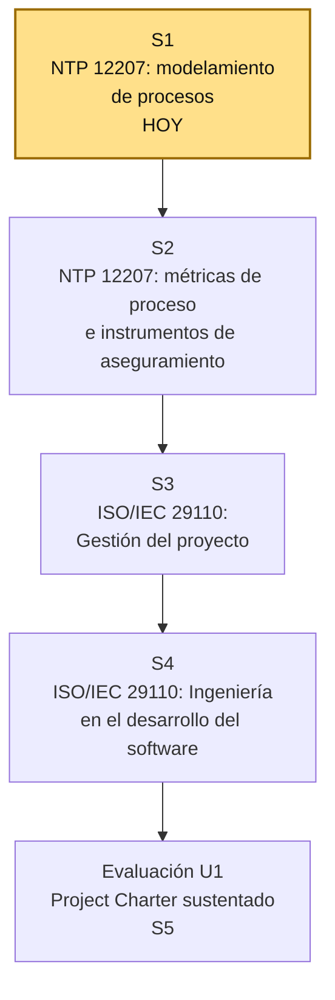

# S1 - NTP ISO/IEC 12207: Modelamiento de Procesos del Ciclo de Vida del Software

## 1. Introducción

Tiempo: 20 min.

### 1.1 Presentación de la sesión

Esta sesión abre el curso de Ingeniería de Software II: presenta el sílabo y construye el marco común de procesos sobre el que se apoyará todo el semestre, la **NTP ISO/IEC 12207**, la norma técnica peruana que modela los procesos del ciclo de vida del software y que fundamentará el Project Charter del proyecto integrador. El porqué de necesitar ese marco común antes de auditar o desarrollar cualquier sistema se desarrolla en 1.6, a partir del caso de la auditoría (o el desarrollo) sin procesos documentados.

### 1.2 Índice

1. Qué es la NTP ISO/IEC 12207 y por qué existe.
2. Estructura de procesos de la norma.
3. Relación con la ISO/IEC 29110.
4. Del modelamiento de procesos al Project Charter.

### 1.3 Propósito de aprendizaje

Al concluir la clase, estarás en condiciones de:

- **Identificar y explicar** la estructura de procesos de la NTP ISO/IEC 12207, y **argumentar** por qué el curso la usa como marco conceptual para iniciar un proyecto integrador (de auditoría o de desarrollo de software) mediante un Project Charter.

### 1.4 Producto de sesión

Mapa de procesos NTP ISO/IEC 12207 priorizados para el proyecto integrador del equipo, con el sistema o proyecto de software elegido (a auditar o a desarrollar) y el equipo de trabajo conformado.

### 1.5 Metodología

**Tabla 1. Metodología de la sesión**

| Actividades a Realizar en el Periodo | Orientaciones generales (Orientaciones Metodológicas) | Material de estudio recomendado |
|---|---|---|
| Revisión previa individual | Leer el sílabo del curso y el resumen de la NTP ISO/IEC 12207 (ver 1.6). Trabajo individual, antes de clase; traer al menos una idea de sistema o proyecto de software para auditar o desarrollar. | Sílabo IS2 U1. |
| Clase presencial | Presentación del sílabo, lectura guiada del estándar y discusión de su estructura de procesos. Trabajo en equipo, siguiendo al docente paso a paso; consulta inmediata ante dudas sobre el alcance de cada grupo de procesos. | Pasos 3.1 a 3.7 de esta guía. |
| Evaluación formativa | Revisión en clase de la propuesta inicial del equipo (sistema elegido, ruta de trabajo, procesos priorizados, roles). La evidencia se completa y sustenta de forma individual, fuera del aula, según los criterios mínimos de la sección 4.4. | Indicaciones de entrega (4.3), rúbrica de evaluación (4.6). |

### 1.6 Motivación de la sesión

#### 1.6.1 Caso: la auditoría (o el desarrollo) sin procesos documentados

Un equipo de estudiantes decide auditar el sistema de facturación de una pequeña empresa. El primer día abren la base de datos y empiezan a anotar "cosas que están mal": campos sin validar, una tabla sin normalizar, un botón que no responde. Una semana después tienen una lista larga de observaciones, pero no pueden responder preguntas básicas: ¿esa observación es un problema de gestión de proyecto o de ingeniería? ¿A qué proceso del ciclo de vida pertenece? ¿Cómo se prioriza frente a otra observación distinta? Sin un marco de procesos, la auditoría es una lista de quejas, no un informe técnico verificable — y lo mismo le ocurriría a un equipo que decidiera **desarrollar** su propio sistema sin saber qué procesos del ciclo de vida debe cubrir.

Pregunta guía:

```text
¿Qué le falta a este equipo para convertir su lista de observaciones en una auditoría (o un desarrollo) técnicamente fundamentada?
```

**Preguntas de análisis**

**Activación de conocimientos previos**

1. ¿Por qué una lista de observaciones sueltas no es una auditoría de calidad?
2. ¿Qué documento inicial habría ordenado el trabajo de este equipo, sea que audite o que desarrolle?

**Comprensión del ciclo de vida del software**

1. ¿Qué problemas genera evaluar (o construir) un sistema sin un marco de procesos común?

### 1.7 Ubicación en el curso

- Unidad: U1 - Calidad en los Procesos de Desarrollo de Software con NTP ISO/IEC 12207 e ISO/IEC 29110.
- Producto de unidad: Project Charter del proyecto integrador (auditoría o desarrollo de software) fundamentado en la NTP ISO/IEC 12207 y la ISO/IEC 29110, con matriz de calidad (atributos, métricas y riesgos).
- Producto del curso: Proyecto Sello: informe de auditoría (o de desarrollo de software) del proyecto integrador, fundamentado progresivamente en la NTP ISO/IEC 12207, la ISO/IEC 29110, la ISO/IEC 25010 y el modelo CMMI evaluado con SCAMPI, sustentado integralmente.
- Avance del producto en esta sesión: equipo de trabajo conformado, sistema o proyecto de software elegido (a auditar o a desarrollar) y primer mapa de procesos NTP ISO/IEC 12207 priorizados.

Roadmap del producto de unidad:

**Figura 1. Roadmap del producto de la unidad**



Hoy se reconoce la estructura completa de procesos de la NTP ISO/IEC 12207 y se elige el sistema o proyecto del semestre. En las siguientes sesiones se profundiza en las métricas de proceso e instrumentos de aseguramiento de calidad (S2), y en los procesos de gestión e ingeniería de la ISO/IEC 29110 aplicados a organizaciones pequeñas (S3-S4). La evaluación de la Unidad 1 valida el Project Charter completo, con su matriz de calidad, sustentado por el equipo.

## 2. Explica

Tiempo: 25 min.

### 2.1 Qué es la NTP ISO/IEC 12207 y por qué existe

La **NTP ISO/IEC 12207** (Norma Técnica Peruana, equivalente nacional de la norma internacional **ISO/IEC/IEEE 12207**, *Systems and Software Engineering — Software Life Cycle Processes*) es el estándar que define y organiza los procesos que intervienen en el ciclo de vida completo del software: desde que se concibe la necesidad hasta que el software se retira de operación. No prescribe una metodología ni una herramienta específica; define **qué procesos** debe cubrir cualquier proyecto de software, sin importar si se ejecuta con Scrum, con un modelo en cascada o con cualquier otro enfoque.

En Perú, la norma es publicada por INDECOPI como adaptación nacional de la norma internacional. El curso la usa como el primer marco de referencia del semestre porque tanto la ruta de **auditoría** (evaluar si un sistema de terceros cumple los procesos esperados) como la ruta de **desarrollo** (construir un sistema propio cubriendo esos mismos procesos) necesitan el mismo mapa de procesos como punto de partida.

**Error frecuente**: confundir "proceso" con "actividad suelta". Un proceso en la NTP ISO/IEC 12207 tiene propósito, resultados esperados y actividades que lo evidencian — no es solo una tarea marcada como hecha.

### 2.2 Estructura de procesos de la norma

La NTP ISO/IEC 12207 organiza los procesos del ciclo de vida del software en cuatro grupos:

**Tabla 2. Grupos de procesos de la NTP ISO/IEC 12207**

| Grupo de procesos | Propósito | Ejemplos de procesos |
|---|---|---|
| Procesos de acuerdo | Formalizan la relación entre quien adquiere y quien provee el software. | Adquisición, Suministro. |
| Procesos organizacionales de habilitación de proyectos | Aseguran que la organización tenga la capacidad para ejecutar proyectos de software de forma sostenida. | Gestión del modelo de ciclo de vida, Gestión de infraestructura, Gestión de recursos humanos, Gestión de la calidad, Gestión del conocimiento. |
| Procesos de gestión de proyecto (procesos técnicos de gestión) | Planifican, controlan y verifican la ejecución del proyecto específico. | Planificación del proyecto, Evaluación y control del proyecto, Gestión de riesgos, Gestión de la configuración, Aseguramiento de la calidad, Medición. |
| Procesos técnicos | Cubren el trabajo de ingeniería propiamente dicho, desde entender la necesidad hasta operar y dar de baja el software. | Definición de requerimientos, Arquitectura, Diseño, Construcción, Integración, Verificación, Validación, Transición, Operación, Mantenimiento, Disposición. |

**Error frecuente**: tratar los cuatro grupos como una secuencia estrictamente lineal. En la práctica se ejecutan de forma concurrente e iterativa a lo largo del proyecto: por ejemplo, la Gestión de la configuración (procesos de gestión de proyecto) acompaña a la Construcción y la Verificación (procesos técnicos) durante todo el ciclo, no solo al final.

### 2.3 Relación con la ISO/IEC 29110

La NTP ISO/IEC 12207 fue diseñada pensando en organizaciones de cualquier tamaño, lo que la hace extensa para un equipo pequeño o un proyecto académico. La **ISO/IEC 29110** (*Lifecycle Profiles for Very Small Entities*, VSE) resuelve ese problema: es un perfil simplificado de gestión e ingeniería dirigido a organizaciones de hasta 25 personas, que selecciona y adapta un subconjunto manejable de los procesos de la NTP ISO/IEC 12207, organizado en dos procesos centrales del **Perfil Básico**:

**Tabla 3. Procesos del Perfil Básico ISO/IEC 29110 y su relación con la NTP ISO/IEC 12207**

| Proceso ISO/IEC 29110 (Perfil Básico) | Relación con la NTP ISO/IEC 12207 |
|---|---|
| Gestión de Proyecto (PM) | Adapta los procesos de gestión de proyecto (planificación, control, riesgos, configuración) a un equipo pequeño. |
| Ingeniería en el Desarrollo del Software (SI) | Adapta los procesos técnicos (requerimientos, diseño, construcción, integración, pruebas) a un alcance acotado. |

El curso trabaja la ISO/IEC 29110 en las sesiones S3 (Gestión del proyecto) y S4 (Ingeniería en el desarrollo del software) de esta misma unidad: la NTP ISO/IEC 12207 da el mapa completo de procesos; la ISO/IEC 29110 da la versión aplicable al tamaño de un equipo académico o de una pequeña organización.

### 2.4 Del modelamiento de procesos al Project Charter

Cada grupo de procesos alimenta directamente un componente del Project Charter y de la matriz de calidad que se construyen en esta unidad:

**Tabla 4. Componentes del Project Charter y los grupos de procesos que los fundamentan**

| Componente del Project Charter | Grupo(s) de procesos que lo fundamenta(n) |
|---|---|
| Objetivos y alcance del proyecto integrador | Procesos de acuerdo; Procesos técnicos (definición de requerimientos). |
| EDT (Estructura de Descomposición del Trabajo) | Procesos de gestión de proyecto. |
| Equipo de trabajo | Procesos organizacionales de habilitación de proyectos. |
| Matriz de calidad (atributos, métricas y riesgos) | Procesos de gestión de proyecto (aseguramiento de la calidad, gestión de riesgos, medición). |
| Ruta elegida (auditoría o desarrollo) | Procesos técnicos (el alcance de ingeniería que se auditará o se ejecutará). |

Un Project Charter que no puede trazarse a un grupo de procesos de la norma es una lista de buenas intenciones, no un documento de auditoría o de ingeniería: por eso el curso exige que cada componente del Project Charter cite explícitamente el proceso de la NTP ISO/IEC 12207 (o de la ISO/IEC 29110) que lo sustenta.

## 3. Aplica: actividad práctica guiada

Tiempo: 2h.

**Actividad:** mapeo de procesos NTP ISO/IEC 12207 y elección del proyecto integrador del semestre.

**Propósito de la actividad:** reconocer la estructura de procesos de la norma, aplicarla a un caso guiado, y usarla para delimitar el sistema o proyecto, la ruta de trabajo y el equipo con el que se desarrollará el proyecto integrador durante el semestre.

**Orientaciones metodológicas:** el docente guía la lectura del extracto del estándar y el análisis del caso paso a paso frente a la clase; los estudiantes replican el mapeo de procesos sobre su propio proyecto elegido, verificando cada paso (grupos de procesos reconocidos, caso reclasificado, proyecto y ruta elegidos, procesos priorizados, equipo conformado) antes de avanzar al siguiente.

**Actividades para realizar:**

- **3.1** Reconocer los cuatro grupos de procesos de la NTP ISO/IEC 12207.
- **3.2** Leer el extracto guiado del estándar.
- **3.3** Analizar el caso guiado y discutir en equipo.
- **3.4** Elegir el sistema o proyecto y la ruta de trabajo (auditoría o desarrollo).
- **3.5** Mapear procesos NTP ISO/IEC 12207 aplicables al proyecto elegido.
- **3.6** Conformar el equipo de trabajo y roles iniciales.
- **3.7** Completar la plantilla de propuesta inicial.

### 3.1 Reconocer los cuatro grupos de procesos de la NTP ISO/IEC 12207

**Producto del paso:** lista de los cuatro grupos de procesos con una frase propia por grupo.

Usando la tabla de 2.2 como referencia, cada estudiante escribe con sus propias palabras qué cubre cada grupo de procesos, sin copiar literalmente la definición.

### 3.2 Leer el extracto guiado del estándar

**Producto del paso:** notas de lectura de los procesos de gestión de proyecto y técnicos.

El docente guía la lectura de los procesos que fundamentan el Project Charter de esta unidad (gestión de proyecto, gestión de riesgos, gestión de la configuración, aseguramiento de la calidad, y el bloque de procesos técnicos). Cada estudiante registra, por proceso, una idea clave y una duda.

### 3.3 Analizar el caso guiado y discutir en equipo

**Producto del paso:** lista de observaciones del caso reclasificadas por proceso.

Retoma el caso de 1.6.1 (auditoría del sistema de facturación). En equipo, toma al menos cuatro observaciones sueltas del caso ("campos sin validar", "tabla sin normalizar", etc.) y reclasifícalas indicando a qué grupo de procesos de la NTP ISO/IEC 12207 pertenecen.

### 3.4 Elegir el sistema o proyecto y la ruta de trabajo

**Producto del paso:** enunciado breve del sistema o proyecto elegido y la ruta de trabajo.

Cada equipo elige el sistema o proyecto de software real o simulado que trabajará durante todo el semestre, y define si seguirá la ruta de **auditoría** (evaluar un sistema propio o de terceros) o la ruta de **desarrollo** (construir un sistema propio). Responde:

1. ¿Qué sistema o proyecto se va a auditar o a desarrollar?
2. ¿Por qué el equipo eligió esa ruta (auditoría o desarrollo)?
3. ¿Quién es el usuario o área afectada por ese sistema?

### 3.5 Mapear procesos NTP ISO/IEC 12207 aplicables al proyecto elegido

**Producto del paso:** tabla de procesos priorizados para el proyecto del equipo.

**Tabla 5. Priorización de grupos de procesos para el proyecto del equipo**

| Grupo de procesos | ¿Aplica al proyecto? | Por qué |
|---|---|---|
| Procesos de acuerdo | | |
| Procesos organizacionales de habilitación de proyectos | | |
| Procesos de gestión de proyecto | | |
| Procesos técnicos | | |

Completa la tabla con el criterio del equipo; el peso de cada grupo varía según la ruta elegida (auditoría o desarrollo).

### 3.6 Conformar el equipo de trabajo y roles iniciales

**Producto del paso:** ficha del equipo con roles iniciales.

Completa:

```text
Nombre del equipo:
Integrantes:
Sistema o proyecto elegido:
Ruta de trabajo (auditoría o desarrollo):
Rol inicial de cada integrante (referente de gestión, de ingeniería, de calidad, etc.):
```

### 3.7 Completar la plantilla de propuesta inicial

**Producto del paso:** propuesta inicial completa del proyecto integrador.

Completa:

```text
Sistema o proyecto elegido:
Ruta de trabajo (auditoría o desarrollo):
Usuario o área afectada:
Grupos de procesos priorizados:
Equipo y roles:
Primer riesgo identificado:
```

## 4. Crea: actividad autónoma

Tiempo: 2h fuera del aula.

### 4.1 Actividad

Consolidación autónoma e individual del mapa de procesos NTP ISO/IEC 12207 priorizado para el proyecto integrador del equipo, documentada en evidencia individual.

Completa y evidencia estas tareas:

1. Confirmar el sistema o proyecto de software del semestre y la ruta de trabajo (auditoría o desarrollo).
2. Redactar en tus propias palabras qué es la NTP ISO/IEC 12207 y por qué el curso la usa como marco conceptual.
3. Redactar en tus propias palabras los cuatro grupos de procesos de la NTP ISO/IEC 12207.
4. Priorizar los grupos de procesos aplicables a tu proyecto, con justificación.
5. Registrar el equipo de trabajo y los roles iniciales.

### 4.2 Propósito

Que cada estudiante demuestre, de forma individual y fuera del aula, que puede reproducir el patrón construido en clase sin el acompañamiento del docente.

Cada estudiante consolida individualmente el mapa de procesos priorizado y la propuesta inicial del proyecto de su equipo.

### 4.3 Indicaciones

Entrega un PDF con el siguiente nombre:

```text
S01_Equipo##_ApellidoNombre.pdf
```

Cada captura de pantalla del informe debe mostrar, sin recortar, el reloj del sistema (fecha y hora) y tu usuario o foto de perfil (Windows, VS Code o navegador) visibles en pantalla — es lo que permite verificar que la evidencia es tuya y que corresponde al momento real de tu trabajo.

#### 4.3.1 Estructura del informe

**Datos del estudiante**

- Nombre:
- Equipo:
- Sesión: S01 - NTP ISO/IEC 12207: Modelamiento de Procesos del Ciclo de Vida del Software
- Rol o aporte realizado:
- Link de GitHub:

**Evidencia técnica**

Incluye capturas o extractos con una breve explicación debajo de cada uno, organizados en los mismos 5 bloques de la rúbrica (4.6) — así queda claro qué evidencia corresponde a cada criterio evaluado:

1. *Comprensión de la norma*
    - Explicación breve, en palabras propias, de qué es la NTP ISO/IEC 12207 y por qué el curso la usa como marco conceptual para el proyecto integrador.
2. *Estructura de procesos*
    - Lista de los cuatro grupos de procesos con descripción propia (equivalente a 3.1).
3. *Sistema o proyecto y ruta elegida*
    - Plantilla de propuesta inicial completa, con el sistema o proyecto y la ruta de trabajo (auditoría o desarrollo) confirmados (equivalente a 3.4 y 3.7).
4. *Priorización de procesos*
    - Tabla de procesos priorizados para el proyecto, con justificación (equivalente a 3.5).
5. *Aporte individual*
    - Ficha del equipo con roles iniciales y el aporte propio señalado (equivalente a 3.6).

**Error o hallazgo**

Describe al menos un riesgo o duda que identificaste al elegir el sistema, la ruta de trabajo o priorizar los procesos:

- Qué ocurrió o qué limitación encontraste.
- Cómo lo identificaste.
- Cómo lo documentaste o qué supuesto tomaste.

**Reflexión técnica breve**

Responde en 5 a 8 líneas:

```text
¿Por qué una auditoría (o un desarrollo) de software debe fundamentarse en un estándar de procesos como la NTP ISO/IEC 12207 antes de emitir cualquier observación?
```

### 4.4 Criterios mínimos de aceptación

La evidencia individual se considera completa si:

- El sistema o proyecto está delimitado y la ruta de trabajo (auditoría o desarrollo) está claramente elegida.
- Los cuatro grupos de procesos de la NTP ISO/IEC 12207 están descritos con palabras propias, sin copia literal.
- Los procesos priorizados para el proyecto están justificados con al menos una razón concreta cada uno.
- El equipo de trabajo y los roles iniciales están registrados.
- La evidencia identifica un aporte individual verificable.
- Cada captura de la evidencia técnica muestra el reloj del sistema y el usuario/perfil visible, sin recortar.
- Las fechas y horas de las capturas son coherentes con el historial de commits de su repositorio en GitHub.
- Incluye un error o hallazgo técnico diagnosticado.
- Incluye la reflexión técnica breve solicitada.

### 4.5 Preguntas de defensa

1. ¿Qué diferencia hay entre un proceso de gestión de proyecto y un proceso técnico según la NTP ISO/IEC 12207?
2. ¿Qué grupo de procesos consideras más crítico para tu proyecto y por qué?
3. ¿Por qué tu equipo eligió la ruta de auditoría o la ruta de desarrollo?
4. ¿Cómo se conecta la ISO/IEC 29110 con la NTP ISO/IEC 12207 que trabajaste hoy?

### 4.6 Rúbrica de evaluación

**Tabla 6. Rúbrica de evaluación**

| Criterio | Peso (%) | A (20 pts) | B (15 pts) | C (10 pts) | D (5 pts) | Nivel obtenido |
|---|---:|---|---|---|---|---:|
| 1. Comprensión de la norma* | 20 | Explica con precisión qué es la NTP ISO/IEC 12207 y su propósito. | Explica correctamente qué es la norma. | Explicación parcial o imprecisa. | No explica qué es la norma. | |
| 2. Estructura de procesos* | 20 | Describe los cuatro grupos de procesos con palabras propias y ejemplos claros. | Describe correctamente los cuatro grupos. | Descripción incompleta o copiada. | No identifica los grupos de procesos. | |
| 3. Sistema o proyecto y ruta elegida* | 20 | Sistema/proyecto delimitado, viable y ruta de trabajo bien justificada. | Sistema/proyecto y ruta delimitados y comprensibles. | Delimitación imprecisa o poco justificada. | No delimita sistema, proyecto ni ruta. | |
| 4. Priorización de procesos* | 20 | Prioriza procesos con justificación sólida y conectada al proyecto. | Prioriza procesos de forma correcta. | Priorización débil o sin justificar. | No prioriza procesos para el proyecto. | |
| 5. Aporte individual* | 20 | Aporte verificable y bien documentado. | Aporte identificable. | Aporte mencionado de forma general. | Sin aporte individual. | |

\* Agregado manual.

Nota final = suma de (`Peso` / 100 × `Puntos del nivel obtenido`) = ____ / 20.

Para usar la rúbrica con IA, solicita:

```text
Evalúa el PDF usando la rúbrica de la sesión.
Para cada criterio selecciona el nivel obtenido usando la escala A=20, B=15, C=10, D=5 puntos.
Justifica brevemente cada nivel asignado.
Verifica que cada captura muestre reloj del sistema y usuario/perfil visible, y que las fechas sean coherentes con el historial de commits de GitHub. Si falta esta evidencia o hay inconsistencias, indícalo explícitamente antes de calificar.
Calcula la nota final con la fórmula: suma de (Peso/100 × Puntos del nivel obtenido), directamente sobre 20.
Indica 2 fortalezas y 2 recomendaciones.
```

## 5. Cierre

Tiempo: 5 min.

**Resumen breve:** hoy el equipo pasó de tener observaciones sueltas sobre un caso sin procesos documentados a tener un sistema o proyecto elegido, un mapa de procesos NTP ISO/IEC 12207 priorizado y un equipo de trabajo conformado — la base del Project Charter que se construye durante la unidad.

**Dinámica participativa:** en una ronda rápida (o con una herramienta digital tipo formulario o encuesta en vivo), cada estudiante comparte en una frase el grupo de procesos que priorizó como más crítico para su proyecto y por qué.

**Metacognición:** cada estudiante responde en voz alta o por escrito: ¿qué parte de la sesión te costó más entender, y cómo la resolviste?

**Proyección:** el mapa de procesos de hoy se retoma en S2 (métricas de proceso e instrumentos de aseguramiento) y se refina con la ISO/IEC 29110 en S3-S4, hasta sustentar el Project Charter completo en la evaluación de la Unidad 1 — igual que en cualquier auditoría o desarrollo profesional, donde el mapa de procesos inicial se ajusta a medida que se conoce mejor el sistema o el proyecto.

## Bibliografía

1. International Organization for Standardization. (2017). *ISO/IEC/IEEE 12207:2017 — Systems and software engineering — Software life cycle processes*. https://www.iso.org/standard/63712.html
2. International Organization for Standardization. (2016). *ISO/IEC/IEEE 29110-5-1-2:2016 — Systems and software engineering — Lifecycle profiles for Very Small Entities (VSE) — Part 5-1-2: Management and engineering guide: Generic profile group: Basic profile*. https://www.iso.org/standard/62711.html
