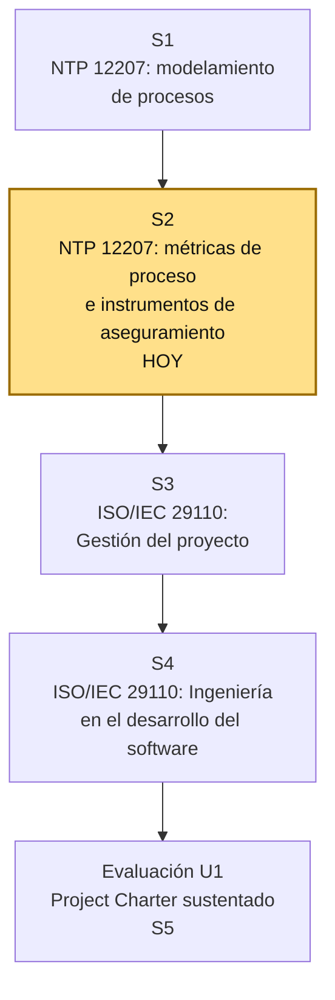

# S2 - NTP ISO/IEC 12207: Métricas de Proceso e Instrumentos de Aseguramiento de la Calidad

## 1. Introducción

Tiempo: 20 min.

### 1.1 Presentación de la sesión

El mapa de procesos priorizado en S1 dice qué procesos importan al proyecto del equipo, pero todavía no dice cómo se sabe si esos procesos se están cumpliendo bien. Esta sesión agrega esa capacidad: métricas de proceso para medir el cumplimiento, e instrumentos de aseguramiento de la calidad (revisiones, inspecciones, checklist) para verificarlo de forma sistemática — la base con la que el equipo auditará o desarrollará su proyecto durante el resto de la unidad.

### 1.2 Índice

1. Por qué un proceso priorizado necesita una métrica.
2. Métricas de proceso: qué miden y cómo se construyen.
3. Instrumentos de aseguramiento de la calidad: revisiones, inspecciones y checklist.
4. De las métricas e instrumentos a la matriz de calidad del Project Charter.

### 1.3 Propósito de aprendizaje

Al concluir la clase, estarás en condiciones de:

- **Diseñar** métricas de proceso y **seleccionar** instrumentos de aseguramiento de la calidad (revisiones, inspecciones, checklist) para al menos dos de los procesos NTP ISO/IEC 12207 priorizados en S1, aplicándolos al proyecto integrador del equipo.

### 1.4 Producto de sesión

Métricas de proceso y checklist de aseguramiento de la calidad para al menos dos procesos priorizados del proyecto integrador, con al menos una revisión o inspección aplicada sobre evidencia real o simulada del proyecto.

### 1.5 Metodología

**Tabla 1. Metodología de la sesión**

| Actividades a Realizar en el Periodo | Orientaciones generales (Orientaciones Metodológicas) | Material de estudio recomendado |
|---|---|---|
| Revisión previa individual | Revisar el mapa de procesos priorizados de S1. Trabajo individual, antes de clase; traer identificado qué evidencia del proyecto (documentos, código, actas) ya existe para revisar. | Evidencia individual de S1. |
| Clase presencial | Explicación guiada de métricas de proceso y de los tres instrumentos de aseguramiento; diseño guiado de una métrica y un checklist, aplicados al caso y luego al proyecto de cada equipo. Trabajo en equipo, siguiendo al docente paso a paso; consulta inmediata ante dudas sobre qué medir. | Pasos 3.1 a 3.6 de esta guía. |
| Evaluación formativa | Revisión en clase de las métricas y el checklist diseñados por cada equipo, y de la primera inspección aplicada. La evidencia se completa y sustenta de forma individual, fuera del aula, según los criterios mínimos de la sección 4.4. | Indicaciones de entrega (4.3), rúbrica de evaluación (4.6). |

### 1.6 Motivación de la sesión

#### 1.6.1 Caso: "parece que mejoró" no es una métrica

El equipo que audita el sistema de facturación (caso de S1) ya reclasificó sus observaciones por grupo de procesos. En la siguiente reunión, alguien dice: "el proceso de gestión de la configuración parece que mejoró esta semana". El docente pregunta: ¿mejoró cuánto, medido cómo? El equipo no tiene respuesta — "parece que mejoró" es una impresión, no un dato verificable. Sin una métrica definida antes de observar el proceso, cualquier conclusión sobre si mejoró o empeoró depende de quién la diga, no de un criterio compartido.

```text
¿Qué necesitaría el equipo definir ANTES de observar el proceso de gestión
de la configuración, para poder decir con datos si mejoró o no?
```

**Preguntas de análisis**

**Activación de conocimientos previos**

1. ¿Qué diferencia hay entre decir "el proceso mejoró" y decir "el número de commits sin mensaje descriptivo bajó de 12 a 3 en dos semanas"?

**Comprensión de métricas e instrumentos de aseguramiento**

1. ¿Por qué una métrica debe definirse antes de observar el proceso, y no después?
2. ¿Qué diferencia hay entre una revisión, una inspección y un checklist como instrumentos de aseguramiento de la calidad?

### 1.7 Ubicación en el curso

- Unidad: U1 - Calidad en los Procesos de Desarrollo de Software con NTP ISO/IEC 12207 e ISO/IEC 29110.
- Producto de unidad: Project Charter del proyecto integrador (auditoría o desarrollo de software) fundamentado en la NTP ISO/IEC 12207 y la ISO/IEC 29110, con matriz de calidad (atributos, métricas y riesgos).
- Producto del curso: Proyecto Sello: informe de auditoría (o de desarrollo de software) del proyecto integrador, fundamentado progresivamente en la NTP ISO/IEC 12207, la ISO/IEC 29110, la ISO/IEC 25010 y el modelo CMMI evaluado con SCAMPI, sustentado integralmente.
- Avance del producto en esta sesión: métricas de proceso e instrumentos de aseguramiento de la calidad (revisiones, inspecciones, checklist) para los procesos priorizados en S1.

**Figura 1. Roadmap del producto de la unidad**



## 2. Explica

Tiempo: 25 min.

### 2.1 Por qué un proceso priorizado necesita una métrica

Priorizar un proceso (S1) responde "esto importa para nuestro proyecto". Pero un proceso priorizado sin forma de medirlo no permite responder si se está cumpliendo bien, ni comparar el estado del proyecto entre dos momentos distintos. La NTP ISO/IEC 12207 incluye, dentro de los procesos de gestión de proyecto, el proceso de **Medición**, cuyo propósito es precisamente dotar a la organización o al proyecto de datos objetivos sobre su propio desempeño — sin medición, el proceso de aseguramiento de la calidad no tiene sobre qué basar sus revisiones.

### 2.2 Métricas de proceso: qué miden y cómo se construyen

Una **métrica de proceso** es una medida cuantificable del desempeño de un proceso del ciclo de vida. Toda métrica útil responde tres preguntas:

**Tabla 2. Componentes de una métrica de proceso**

| Componente | Pregunta que responde | Ejemplo |
|---|---|---|
| Qué se mide | ¿Cuál es el dato concreto a observar? | Número de commits sin mensaje descriptivo. |
| Cómo se mide | ¿De dónde sale el dato y con qué frecuencia? | Revisión del historial de Git, una vez por semana. |
| Qué significa el resultado | ¿Qué valor se considera aceptable, y cuál alerta un problema? | Menos de 3 por semana: aceptable; 3 o más: revisar con el equipo. |

**Tabla 3. Ejemplos de métricas por grupo de procesos**

| Grupo de procesos (NTP ISO/IEC 12207) | Métrica de ejemplo |
|---|---|
| Procesos de gestión de proyecto | % de tareas planificadas completadas en la fecha estimada. |
| Procesos técnicos | Número de requerimientos que cambiaron después de aprobados. |
| Procesos organizacionales de habilitación de proyectos | Número de integrantes del equipo con acceso documentado al repositorio. |

**Error frecuente**: definir una métrica que no se puede obtener con los medios reales del proyecto (por ejemplo, "tiempo promedio de respuesta a incidentes" cuando no existe ningún registro de incidentes). Una métrica que no se puede medir con la evidencia disponible no sirve — antes de definirla, verifica que exista una fuente de datos real.

### 2.3 Instrumentos de aseguramiento de la calidad: revisiones, inspecciones y checklist

El proceso de **Aseguramiento de la calidad** (dentro de los procesos de gestión de proyecto de la NTP ISO/IEC 12207) se apoya en tres instrumentos complementarios:

**Tabla 4. Instrumentos de aseguramiento de la calidad**

| Instrumento | Qué es | Cuándo se usa |
|---|---|---|
| Revisión | Evaluación de un producto de trabajo (documento, código, plan) por una o más personas, buscando desviaciones frente a lo esperado. | Sobre un entregable ya producido (un documento, un módulo de código). |
| Inspección | Revisión formal, estructurada, con roles definidos (moderador, lector, revisores) y un registro escrito de los defectos encontrados. | Cuando el producto de trabajo es crítico y se requiere trazabilidad de los defectos hallados. |
| Checklist | Lista de verificación con criterios puntuales, marcados como cumplidos o no cumplidos. | Para verificar de forma rápida y repetible que un producto de trabajo cumple un conjunto fijo de condiciones. |

Los tres instrumentos no son excluyentes: un equipo puede usar un checklist como guía rápida durante una inspección formal, y la inspección puede a su vez alimentar una métrica (por ejemplo, "número de defectos encontrados por inspección").

**Error frecuente**: usar un checklist genérico copiado de internet sin adaptarlo a los procesos priorizados del proyecto propio. Un checklist de aseguramiento de la calidad debe verificar exactamente los criterios que el equipo definió como relevantes en S1, no una lista genérica sin relación con el proyecto.

### 2.4 De las métricas e instrumentos a la matriz de calidad del Project Charter

**Tabla 5. Componentes de la matriz de calidad y su origen**

| Componente de la matriz de calidad | De dónde sale |
|---|---|
| Atributo de calidad | Proceso priorizado en S1. |
| Métrica | Definida en 2.2, siguiendo los tres componentes de la Tabla 2. |
| Instrumento de verificación | Revisión, inspección o checklist (2.3), elegido según el tipo de producto de trabajo a evaluar. |
| Riesgo asociado | Qué pasa si la métrica muestra un resultado fuera de lo aceptable. |

Esta tabla es exactamente la matriz de calidad que se consolida en el Project Charter, evaluado en S5.

## 3. Aplica: actividad práctica guiada

Tiempo: 2h.

**Actividad:** diseño de métricas de proceso e instrumentos de aseguramiento de la calidad para el proyecto integrador del equipo.

**Propósito de la actividad:** que cada equipo defina métricas verificables para al menos dos procesos priorizados en S1, seleccione el instrumento de aseguramiento adecuado para cada una, y aplique al menos una revisión o inspección real sobre evidencia del proyecto.

**Orientaciones metodológicas:** el docente diseña en vivo una métrica y un checklist sobre el caso de 1.6.1, y aplica una inspección guiada; cada equipo replica el mismo patrón sobre dos procesos priorizados de su propio proyecto, verificando que cada métrica tenga fuente de datos real antes de avanzar al siguiente paso.

**Actividades para realizar:**

- **3.1** Elegir dos procesos priorizados para medir.
- **3.2** Diseñar una métrica de proceso para cada uno.
- **3.3** Elegir el instrumento de aseguramiento adecuado para cada métrica.
- **3.4** Construir un checklist de aseguramiento de la calidad.
- **3.5** Aplicar una revisión o inspección sobre evidencia real o simulada.
- **3.6** Consolidar la matriz de calidad del proyecto.

### 3.1 Elegir dos procesos priorizados para medir

**Producto del paso:** dos procesos, de los priorizados en S1, seleccionados para esta sesión.

Retoma la Tabla 5 de S1 (priorización de grupos de procesos) y elige dos procesos concretos dentro de esos grupos (no el grupo completo) que el equipo pueda medir con evidencia real del proyecto.

### 3.2 Diseñar una métrica de proceso para cada uno

**Producto del paso:** dos métricas completas, siguiendo los tres componentes de 2.2.

**Tabla 6. Métricas de proceso del proyecto del equipo**

| Proceso | Qué se mide | Cómo se mide | Valor aceptable |
|---|---|---|---|
| | | | |
| | | | |

### 3.3 Elegir el instrumento de aseguramiento adecuado para cada métrica

**Producto del paso:** instrumento justificado para cada métrica de 3.2.

Para cada métrica, responde: ¿el producto de trabajo que alimenta esta métrica se verifica mejor con una revisión simple, una inspección formal, o un checklist? Justifica en una línea por métrica.

### 3.4 Construir un checklist de aseguramiento de la calidad

**Producto del paso:** checklist de al menos cinco criterios, adaptado al proyecto propio.

```text
Criterio 1: [ ] Cumple  [ ] No cumple
Criterio 2: [ ] Cumple  [ ] No cumple
Criterio 3: [ ] Cumple  [ ] No cumple
Criterio 4: [ ] Cumple  [ ] No cumple
Criterio 5: [ ] Cumple  [ ] No cumple
```

Cada criterio debe conectarse explícitamente con uno de los dos procesos elegidos en 3.1.

### 3.5 Aplicar una revisión o inspección sobre evidencia real o simulada

**Producto del paso:** registro de una revisión o inspección aplicada, con al menos un hallazgo.

Aplica el checklist de 3.4 (o una inspección más formal, si el equipo cuenta con roles definidos) sobre un producto de trabajo real del proyecto (un documento, un fragmento de código, un acta). Registra:

```text
Producto de trabajo revisado:
Instrumento aplicado:
Hallazgo(s) encontrado(s):
Acción propuesta:
```

### 3.6 Consolidar la matriz de calidad del proyecto

**Producto del paso:** matriz de calidad consolidada, siguiendo la Tabla 5 de 2.4.

**Tabla 7. Matriz de calidad del proyecto del equipo**

| Atributo de calidad (proceso) | Métrica | Instrumento | Riesgo asociado |
|---|---|---|---|
| | | | |
| | | | |

## 4. Crea: actividad autónoma

Tiempo: 2h fuera del aula.

### 4.1 Actividad

Cada estudiante consolida, de forma individual y fuera del aula, las métricas de proceso y el checklist de aseguramiento de la calidad diseñados en clase, aplicándolos a evidencia real del proyecto.

Completa y evidencia estas tareas:

1. Documentar al menos dos métricas de proceso completas (qué se mide, cómo, valor aceptable).
2. Justificar el instrumento de aseguramiento elegido para cada métrica.
3. Presentar el checklist de aseguramiento de la calidad con al menos cinco criterios.
4. Aplicar el checklist (o una inspección) sobre un producto de trabajo real del proyecto, con al menos un hallazgo documentado.
5. Consolidar la matriz de calidad del proyecto.

### 4.2 Propósito

Que cada estudiante demuestre, de forma individual y fuera del aula, que puede reproducir el patrón construido en clase sin el acompañamiento del docente.

### 4.3 Indicaciones

Entrega un PDF con el siguiente nombre:

```text
S02_Equipo##_ApellidoNombre.pdf
```

Cada captura de pantalla del informe debe mostrar, sin recortar, el reloj del sistema (fecha y hora) y tu usuario o foto de perfil (Windows, VS Code o navegador) visibles en pantalla — es lo que permite verificar que la evidencia es tuya y que corresponde al momento real de tu trabajo.

#### 4.3.1 Estructura del informe

**Datos del estudiante**

- Nombre:
- Equipo:
- Sesión: S02 - NTP ISO/IEC 12207: Métricas de Proceso e Instrumentos de Aseguramiento de la Calidad
- Rol o aporte realizado:
- Link de GitHub:

**Evidencia técnica**

Incluye capturas o extractos con una breve explicación debajo de cada uno, organizados en los mismos 4 bloques de la rúbrica (4.6):

1. *Métricas de proceso*
    - Las dos métricas completas de 3.2, con sus tres componentes.
2. *Instrumentos de aseguramiento*
    - Justificación del instrumento elegido para cada métrica (3.3).
3. *Checklist e inspección aplicada*
    - Checklist completo (3.4) y registro de la revisión/inspección aplicada con su hallazgo (3.5).
4. *Matriz de calidad*
    - Matriz de calidad consolidada (3.6).

**Error o hallazgo**

Describe el hallazgo real encontrado al aplicar el checklist o la inspección sobre el producto de trabajo del proyecto (3.5), o una métrica que tuviste que rediseñar por no tener fuente de datos real.

**Reflexión técnica breve**

Responde en 5 a 8 líneas:

```text
¿Por qué "parece que mejoró" no reemplaza a una métrica definida antes de observar el proceso? Relaciona tu respuesta con el hallazgo que documentaste en esta sesión.
```

### 4.4 Criterios mínimos de aceptación

La evidencia individual se considera completa si:

- Cada métrica define con claridad qué se mide, cómo se mide y qué valor se considera aceptable.
- El instrumento de aseguramiento elegido para cada métrica está justificado.
- El checklist tiene al menos cinco criterios, conectados con los procesos priorizados del proyecto.
- Se registra al menos un hallazgo real al aplicar el checklist o una inspección.
- La matriz de calidad conecta atributo, métrica, instrumento y riesgo para cada fila.
- Cada captura de la evidencia técnica muestra el reloj del sistema y el usuario/perfil visible, sin recortar.
- Las fechas y horas de las capturas son coherentes con el historial de commits de su repositorio en GitHub.
- Incluye un error o hallazgo técnico diagnosticado.
- Incluye la reflexión técnica breve solicitada.

### 4.5 Preguntas de defensa

1. ¿Por qué elegiste esos dos procesos para medir y no otros?
2. ¿Cómo verificarías si tu métrica realmente refleja el desempeño del proceso?
3. ¿Por qué elegiste ese instrumento de aseguramiento (revisión, inspección o checklist) y no otro?
4. ¿Qué hallazgo encontraste al aplicar tu checklist, y qué acción propondrías frente a él?
5. ¿Qué riesgo del proyecto se conecta con cada métrica de tu matriz de calidad?

### 4.6 Rúbrica de evaluación

**Tabla 8. Rúbrica de evaluación**

| Criterio | Peso (%) | A (20 pts) | B (15 pts) | C (10 pts) | D (5 pts) | Nivel obtenido |
|---|---:|---|---|---|---|---:|
| 1. Métricas de proceso* | 25 | Métricas claras, medibles con evidencia real y bien conectadas al proceso. | Métricas correctas con detalles menores imprecisos. | Métricas parcialmente medibles o poco claras. | No presenta métricas válidas. | |
| 2. Instrumentos de aseguramiento* | 25 | Instrumento bien justificado y adecuado al producto de trabajo evaluado. | Instrumento presente con justificación básica. | Instrumento poco conectado con la métrica. | No justifica el instrumento elegido. | |
| 3. Checklist e inspección aplicada* | 25 | Checklist completo y adaptado al proyecto; hallazgo real documentado con claridad. | Checklist aplicado con hallazgo presente. | Checklist genérico o hallazgo poco claro. | No presenta checklist ni hallazgo. | |
| 4. Matriz de calidad* | 25 | Matriz completa, coherente y bien conectada con los procesos priorizados en S1. | Matriz completa con conexiones básicas. | Matriz incompleta o poco conectada. | No presenta matriz de calidad. | |

\* Agregado manual.

Nota final = suma de (`Peso` / 100 × `Puntos del nivel obtenido`) = ____ / 20.

Para usar la rúbrica con IA, solicita:

```text
Evalúa el PDF usando la rúbrica de la sesión.
Para cada criterio selecciona el nivel obtenido usando la escala A=20, B=15, C=10, D=5 puntos.
Justifica brevemente cada nivel asignado.
Verifica que cada captura muestre reloj del sistema y usuario/perfil visible, y que las fechas sean coherentes con el historial de commits de GitHub. Si falta esta evidencia o hay inconsistencias, indícalo explícitamente antes de calificar.
Calcula la nota final con la fórmula: suma de (Peso/100 × Puntos del nivel obtenido), directamente sobre 20.
Indica 2 fortalezas y 2 recomendaciones.
```

## 5. Cierre

Tiempo: 5 min.

**Resumen breve:** hoy los procesos priorizados en S1 dejaron de ser una lista y se volvieron medibles: cada proceso elegido cuenta con una métrica verificable, un instrumento de aseguramiento adecuado y un hallazgo real documentado, consolidados en la matriz de calidad del proyecto.

**Dinámica participativa:** cada equipo comparte en una frase el hallazgo más relevante que encontró al aplicar su checklist o inspección.

**Metacognición:** ¿qué parte de diseñar una métrica te costó más — decidir qué medir, cómo medirlo, o definir qué resultado es aceptable?

**Proyección:** en S3 la matriz de calidad de hoy se conecta con el proceso de Gestión del Proyecto de la ISO/IEC 29110, adaptando estas mismas métricas e instrumentos al perfil simplificado de una organización pequeña.

## Bibliografía

1. International Organization for Standardization. (2017). *ISO/IEC/IEEE 12207:2017 — Systems and software engineering — Software life cycle processes*. https://www.iso.org/standard/63712.html
2. International Organization for Standardization. (2016). *ISO/IEC/IEEE 29110-5-1-2:2016 — Systems and software engineering — Lifecycle profiles for Very Small Entities (VSE) — Part 5-1-2: Management and engineering guide: Generic profile group: Basic profile*. https://www.iso.org/standard/62711.html
